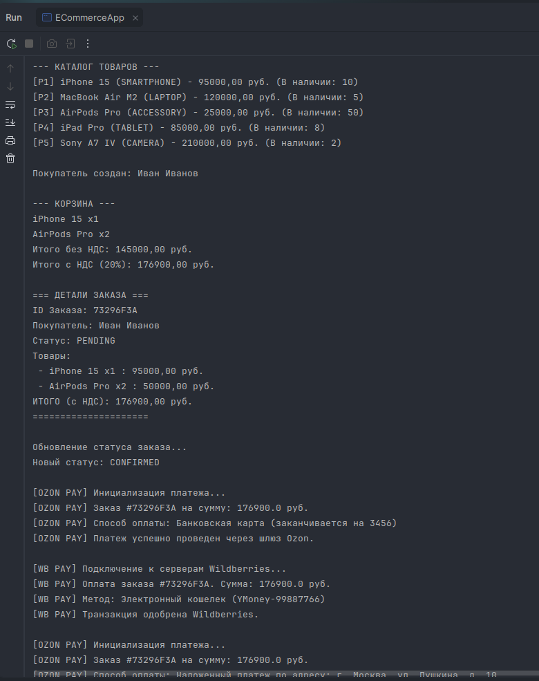
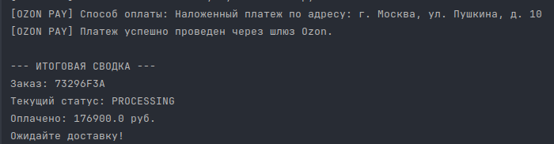
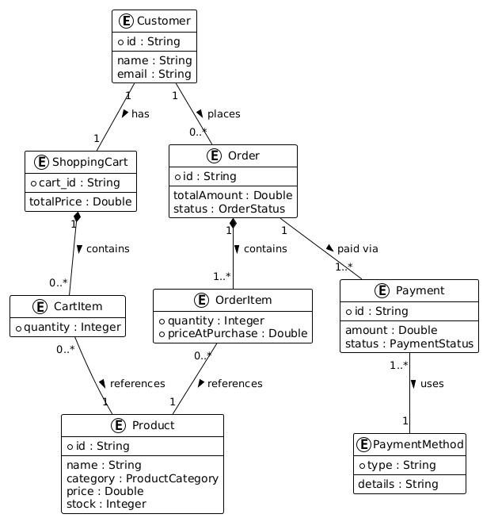

# Консольное приложение электронной коммерции (ECommerceApp)

---

## Описание проекта

Спроектировано и реализовано консольное приложение интернет-магазина, демонстрирующее объектно-ориентированный дизайн на современном языке Java. В проекте реализованы базовые механики e-commerce: ведение каталога товаров, работа с корзиной (включая расчет НДС), оформление заказа и его оплата.

### Ключевые архитектурные решения и средства Java:
- **Паттерн «Стратегия»:** Применен для реализации провайдеров платежей (`Payment`). В зависимости от выбранного шлюза вызывается либо `OzonPayment`, либо `WildberriesPayment`.
- **Records:** Использованы для неизменяемых структур данных (DTO): `Product`, `CartItem`, `OrderItem`.
- **Sealed Interfaces:** Интерфейс `PaymentMethod` ограничен (sealed) и разрешает реализацию только строго определенным классам (`CreditCardPayment`, `DigitalWalletPayment`, `CashOnDelivery`).
- **Коллекции:** Каталог товаров базируется на `HashMap` для быстрого поиска по ID. Корзина и заказы используют `ArrayList`.
- **Enums:** Статусы и категории строго типизированы (`OrderStatus`, `ProductCategory`, `PaymentStatus`).

---

## Порядок сдачи

**Группа:** ПИ24-2в

**Команда:** House MD

**Студенты и роли:**
1. Грицук Максим Вадимович — порядковый номер в группе: 3
2. Коршиков Игорь Сергеевич — порядковый номер в группе: 7
3. Облачков Дмитрий Алексеевич — порядковый номер в группе: 9

---

## Чек-лист студента

- [x] ERD подготовлена и отражена в материалах сдачи  
- [x] Все требуемые типы и пакеты присутствуют  
- [x] Использованы records, sealed `PaymentMethod`, перечисления, `ArrayList`, `HashMap`  
- [x] Реализованы `Payment`, `OzonPayment`, `WildberriesPayment` (Стратегия)  
- [x] Проект компилируется и запускается; в README есть **скриншот**  
- [x] Указаны **группа**, **команда**, **ФИО**, **порядковые номера** в письме и README  
- [x] Сдано **до дедлайна**  

---

## Демонстрация работы (Сценарий в `main`)

При запуске главного класса `ECommerceApp` последовательно выполняются следующие шаги:
1. Вывод каталога из 5 товаров различных категорий.
2. Создание профиля покупателя.
3. Наполнение корзины товарами, расчет промежуточного итога и финальной суммы с НДС (20%).
4. Оформление заказа (`checkout`), очистка корзины и перевод статуса заказа из `PENDING` в `CONFIRMED`.
5. Демонстрация трех сценариев оплаты (с выводом деталей транзакции):
   - Шлюз Ozon + Банковская карта
   - Шлюз Wildberries + Электронный кошелек
   - Шлюз Ozon + Наложенный платеж
6. Вывод итоговой сводки по заказу с обновленным статусом (`PROCESSING`).

---

## Скриншот работы программы





---

## ER-Диаграмма (ERD)

Спроектированная диаграмма сущностей, атрибутов и связей (cardinality) приложена к проекту.

Код для его создания лежит в корневой папке проекта в файле erd.txt.



---

## Инструкция по запуску

1. Склонируйте репозиторий на локальную машину:
   ```bash
   git clone https://github.com/TheSlize/ModernTechHomeTask.git
   ```
2. Откройте проект в **IntelliJ IDEA**.
3. Убедитесь, что в `File -> Project Structure` установлена версия **Java 17 или выше**.
4. Перейдите в файл `src/main/java/com/moderntech/ecommerce/main/ECommerceApp.java`.
5. Запустите метод `main` (зеленый треугольник на полях слева от кода).
